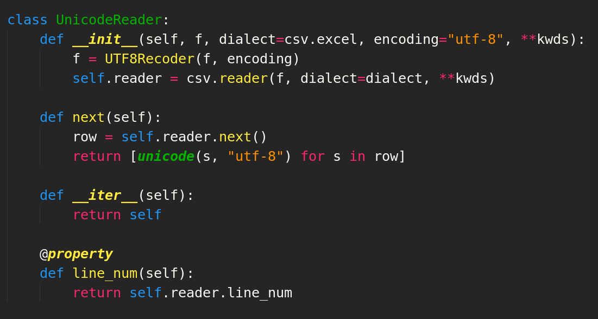

# Lego-land-theme-sublime-text-3
Inspired by the Dark Lemon Material theme for vscode, I made this syntax theme for sublime text 3.

It has some changes as you might notice. 

My focus has been on:
*  Bright colors
*  Readability
*  Fast readability (you know when you see a method, you know when you see a class etc)

## Fully Support
*  Python

## Kinda works with
*  Javascript
*  Java
*  HTML
*  CSS
*  Others?

## Installation
put the file in your Themes folder in your packages folder (ctrl+shift+p -> browse packages)
pick the theme with: (ctrl+shift+p -> select color theme -> Lego-land)

## Please let me know of any issues on this page.

Thanks! 

